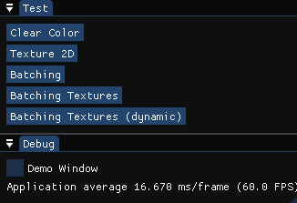
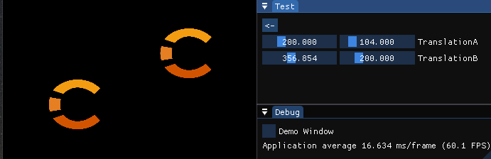
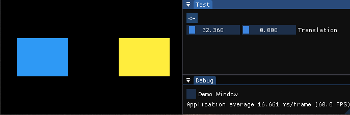
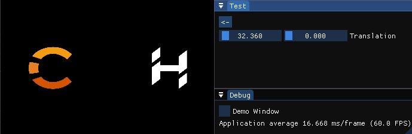
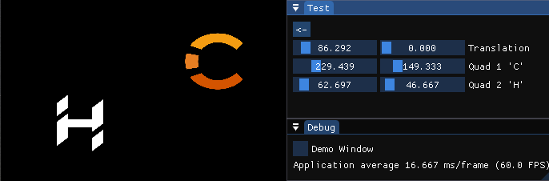

# ChernoOpenGL-CMake

**CMake**-based implementation of TheCherno's [OpenGL series](https://www.youtube.com/playlist?list=PLlrATfBNZ98foTJPJ_Ev03o2oq3-GGOS2) with minimal code deviancy according to videos.

### Features

- **C++ 17**
- **cmake** - cross-platform build system
	- cross-platform dependencies handling
	- tested on:
		- Windows 10 - `Visual Studio 2022`, `VS Code v1.75`: `MSVC` 19.34, `GCC` 11.2 (Rev6, Built by MSYS2 project)
		- Linux Mint 20 - `VS Code v1.75`: `GCC` 9.4, `Clang` 10.0
- **perfect commits** - reached through git-history rewriting
	- pros: clear diffs between commits, without typos (best for learn-repositories)
	- cons: unstable commit hashes and timestamps
	- commands: `rebase -i <commit>~`/`rebase -i --root`; (then follow `status` hints)
- **git-submodules** - each dependency present as a submodule
	- much clear dependency-introduction commits
	- up-to-date source of dependencies' repositories
	- no need for additional downloads during the install stage

### Differences

- **header-only** due to my laziness :) - more compact codebase :+1:
- **error-logging** - both `GLCall()` macro and `glDebugMessageCallback()`:
	- debugging stuff moved from `Renderer.hpp` to new `Utility.hpp` file
	- awesome breakpoints on calls with errors with `GLCall()`
	- detailed GPU-vendor error description with `glDebugMessageCallback`:
		- can be implemented in OpenGL versions prior to 4.3 (by GPU-vendor)
		- worked on OpenGL 4.0 (Intel CPU) for me
- **imgui docking** branch - allows moving imgui-window outside
- **adopted** the last 4 (*Batch Rendering* related) commits
	- Cherno explained *Batch Rendering* with different source code repository
- some **stl::type_traits** related bragging :sunglasses:


### Configure and Build:

Clone repository: `git clone --recurse --shallow-submodules https://github.com/Challanger524/ChernoOpenGL-CMake.git`

<details><summary>Visual Studio</summary>

Official documentation: [CMake projects in Visual Studio](https://learn.microsoft.com/en-us/cpp/build/cmake-projects-in-visual-studio?view=msvc-170&viewFallbackFrom=vs-2019)

> _C++ CMake tools for Windows_ module should be installed (see docs [Installation](https://learn.microsoft.com/en-us/cpp/build/cmake-projects-in-visual-studio?view=msvc-170#installation) part)

1. open the project folder with _Visual Studio_ (and enable CMake via dialog prompt, if any)
2. in the upper toolbar choose `MSVC` configuration
3. Project->Configure ChernoOpenGL
4. Build->Build All
5. set `CMakeLists.txt` as _Startup Item_ via _Solution Explorer_ (or see [Debugging CMake projects](https://learn.microsoft.com/en-us/cpp/build/cmake-projects-in-visual-studio?view=msvc-170#debugging-cmake-projects) part)
6. Debug->Start Debugging
</details>

<p>
<details><summary>VS Code</summary>

Official documentation: [Get started with CMake Tools on Linux](https://code.visualstudio.com/docs/cpp/cmake-linux) (less suitable article then as for Visual Studio)

> 1._C++_ and 2._CMake Tools_ extensions should be installed (see docs [Prerequisites](https://code.visualstudio.com/docs/cpp/cmake-linux#_prerequisites) part)

1. open the project folder with _VS Code_
2. choose suitable configuration preset via dialog (CMake) prompt, or:
	- open Command Palette (`Ctrl+Shift+P`) and type `CMake: Select Configure Preset` then choose suitable
	- open Command Palette (`Ctrl+Shift+P`) and type `CMake: Configure ` (or press a _build_ (:radio_button:) button in the bottom toolbar)
3. open Command Palette (`Ctrl+Shift+P`) and type `CMake: Debug ` (or press a _debug_ (:bug: near :arrow_forward:) button in the bottom toolbar)
</details>

<p>
<details><summary>CMake command line</summary>

> Presets were introduced in CMake 3.19

> There are an issue with resource dependencies since `set(EXECUTABLE_OUTPUT_PATH ${CMAKE_SOURCE_DIR})` may not guarantee that executable will be near `res/` folder `¯\_(ツ)_/¯`

1. `cmake -S . --list-presets`
2. `cmake -S . --preset=<msvc/clang/gcc>`
3. Build:
	- Visual Studio:
		1. open `out/build/<preset>/ChernoOpenGL.sln`
		2. Solution Explorer->ChernoOpenGL->Properties->Set as Startup Project
		3. Build->Build Solution
		4. Solution Explorer->ChernoOpenGL->Properties->Debugging->Working Directory: `$(ProjectDir)`->`$(ProjectDir)..\..\..\`
		5. Debug->Start Debugging

</details>

-----

Special thanks to **speauty**'s [ChernoOpenGL](https://github.com/speauty/ChernoOpenGL) implementation for working and mostly accurate code which greatly saved me time.

Misc:
- It took a bit more than a month to finish this project and half a day to port on Linux (and a week to polish all warnings and complete documentation)
- This project helped me to cure: git- and cmake- anxiety ;)
- Cherno is the only and the best C++ teacher, see also his [C++ playlist](https://www.youtube.com/playlist?list=PLlrATfBNZ98dudnM48yfGUldqGD0S4FFb).
- Console output example:
	```cmd
	Info: GLEW version: 2.2.0
	Info: GL   version: 3.3.0 NVIDIA 516.59
	Info: GLSL version: 3.30 NVIDIA via Cg compiler
	Info: GPU  vendor : NVIDIA Corporation
	Info: Renderer    : NVIDIA GeForce GTX 1060 3GB/PCIe/SSE2
	Info: ImGui version: 1.89 WIP +viewport +docking

	Trace: Registering test: Clear Color
	Trace: Registering test: Batching
	Trace: Registering test: Batching Textures
	Trace: Registering test: Batching Textures (dynamic)
	```

- Screenshots:
<p align="center">       <br><em>Test Menu</em></p>
<p align="center"><br><em>Clear Color test</em></p>
<p align="center"> <br><em>Texture 2D test</em></p>
<p align="center">   <br><em>Batching test</em></p>
<p align="center"><br><em>Batching Textures test</em></p>
<p align="center"><br><em>Batching Textures (dynamic) test</em></p>
