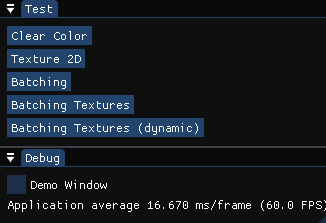
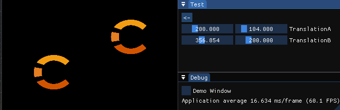
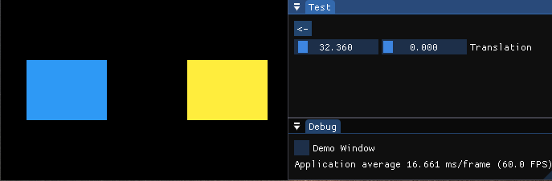
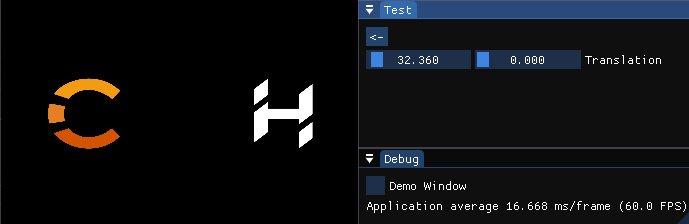
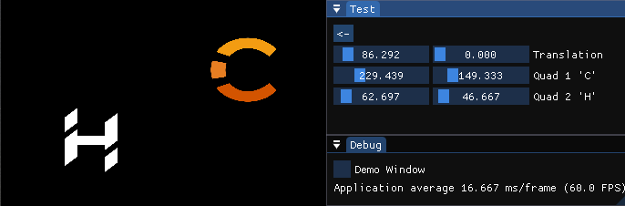

# ChernoOpenGL-CMake

**CMake**-based implementation of TheCherno's [OpenGL series](https://www.youtube.com/playlist?list=PLlrATfBNZ98foTJPJ_Ev03o2oq3-GGOS2) with minimal code deviance according to videos.

## Features

- **C++ 17**
- **CMake** - cross-platform build system
	- cross-platform dependencies handling
	- tested on:
		- Windows 10 - `Visual Studio 2022`, `VS Code v1.86`: `MSVC` 19.34, `Clang` 17.0.4, `GCC` 13.2 (Rev2, Built by MSYS2 project)
		- Linux Mint 20 - `VS Code v1.75`: `GCC` 9.4, `Clang` 10.0
		- MacOS (Mac Mini M2) - `VS Code`: `GCC`, `Apple-Clang`
- **perfect commits** - reached through git-history rewriting
	- pros: clean diffs between commits (best for learn-repositories)
	- pros: no typo/logic fixing or improving separate commits
	- cons: unstable (ever changing) commit _hashes_ and _timestamps_
	- commands:
		- `rebase -i <commit>~`/`rebase -i --root`; (then follow `status` hints)
		- `git rm <submodule_path>` # the only way to change submodule \<name\> field
		- `git submodule add --depth 1 --name <name> [-b <branch>] -- <url> [<path>]`
		- `git filter-repo --refs <branch> --replace-text <(echo 'regex:Dependencies/==>deps/')`
		- `git filter-repo --refs <branch> --replace-text <(echo 'regex:^\xEF\xBB\xBF==>')` # strip BOM
- **git submodules** - each dependency present as a submodule
	- much clear dependency-introduction commits
	- up-to-date source of dependencies' repositories
	- no need for additional downloads during the install stage

### Differences

- **header-only** due to my laziness :) - more compact codebase :+1:
- **error-logging** - debug output with `GL_KHR_debug`:`glDebugMessageCallback()` (if possible):
	- debugging stuff moved from `Renderer.hpp` to new `Utility.hpp`
	- detailed GPU-vendor error description with **debug output**:
		- can be implemented in OpenGL versions prior to 4.3 (by GPU-vendor)
		- worked on OpenGL 4.0 (Intel CPU) (on old tiny laptop)
- **imgui docking** branch - allows moving imgui-windows outside and to dock them to each other
- **batch rendering** episodes - adopted with last 4 commits
	- The Cherno explained with non-related source code (repository)
- some **stl::type_traits** related bragging :sunglasses: (`Utility.hpp`: `GLASSERT(<gl_(un)signed_int_ret>)` macro)

### Debatable

> All _concerns_ can be expressed via GitHub [Project's Issues](https://github.com/Challanger524/ChernoOpenGL-CMake/issues) (one issue per concern)

- headers-only (without sources)
- src fluid braces/oneliners (un)style - for compactness and grouping
- some silly comments like: [sc1](https://github.com/Challanger524/ChernoOpenGL-CMake/blob/main/src/Utility.hpp#:~:text=//%20So%20genious%20%2D_%2D%20to%20not%20use%20unsigned%20everywhere%20//%20Metaprogramming%20%3D%3D%20my%20love%20%E2%9D%A4%EF%B8%8F)
- **clean includes** - like `deps/stb/stb` for deps with sources in roots
	- pros: more precise compiler include/search paths
	- just: better (noworse) IDE include hints
	- cons: need too adjust `CMake` on each new dependency

## Clone
``` shell
git clone --recurse --shallow-submodules "https://github.com/Challanger524/ChernoOpenGL-CMake.git"
```

## Prerequisites

- **CMake** - cross-platform build automation system
	- (for minimal version see [CMakeLists.txt#L1](CMakeLists.txt#L1))
<!-- @import "CMakeLists.txt" {line_begin=0 line_end=1} -->
- **Ninja** - small build system with a focus on speed
- **C++ compiler** (any): MSVC / GCC / Clang
- on GNU Linux:
	- install dev libs listed below and/or google CMake log for other required
	- `sudo apt-get install`: `libxi-dev libxrandr-dev libxcursor-dev libxinerama-dev libopengl-dev`

## Build

<details><summary>Visual Studio</summary>

Official documentation: [CMake projects in Visual Studio](https://learn.microsoft.com/en-us/cpp/build/cmake-projects-in-visual-studio?view=msvc-170&viewFallbackFrom=vs-2019)

> `C++ CMake tools for Windows` module must be installed (see docs [Installation](https://learn.microsoft.com/en-us/cpp/build/cmake-projects-in-visual-studio?view=msvc-170#installation) part)

0. open the project folder with _Visual Studio_ (and enable CMake via dialog prompt, if any)
0. in the upper toolbar choose `MSVC` configuration
0. Project->Configure ChernoOpenGL
0. Build->Build All
0. set `CMakeLists.txt` as _Startup Item_ via _Solution Explorer_ (or see [Debugging CMake projects](https://learn.microsoft.com/en-us/cpp/build/cmake-projects-in-visual-studio?view=msvc-170#debugging-cmake-projects) part)
0. Debug->Start Debugging
</details>

<p>
<details><summary>VS Code</summary>

Official documentation: [Get started with CMake Tools on Linux](https://code.visualstudio.com/docs/cpp/cmake-linux) (less suitable article then as for Visual Studio)

> 1.`C/C++` and 2.`CMake Tools` extensions (by Microsoft) must be installed (see docs [Prerequisites](https://code.visualstudio.com/docs/cpp/cmake-linux#_prerequisites) part)

<details><summary>Note: on Windows...</summary>

when building with `msvc` preset, to rid off unconfigured preset messages - you need to [run VS Code from a Developer Command Prompt for Visual Studio](
https://code.visualstudio.com/docs/cpp/config-msvc#_check-your-microsoft-visual-c-installation:~:text=To%20use%20MSVC%20from%20a%20command%20line%20or%20VS%20Code%2C%20you%20must%20run%20from%20a%20Developer%20Command%20Prompt%20for%20Visual%20Studio)

I created a _shorcut_ to launch VS Code with next `Target`:
```
%comspec% /C "C:\Program Files\Microsoft Visual Studio\2022\Community\Common7\Tools\VsDevCmd.bat" & code
```

> with `/C` option it should close itself automatically, but sometimes it is not - so just close it manually after VS Code launched.

</details><p>

0. open the project folder
0. configure from preset via dialog (CMake) prompt, or:
	- select preset - open Command Palette (`Ctrl+Shift+P`) and type `CMake: Select Configure Preset` then choose suitable
	- configure - open Command Palette (`Ctrl+Shift+P`) and type `CMake: Configure` (if not started automatically)
0. build - open Command Palette (`Ctrl+Shift+P`) and type `CMake: Build `(or press a _build_ (:radio_button:) button in the bottom toolbar)
0. run:
	- debug - open Command Palette (`Ctrl+Shift+P`) and type `CMake: Debug ` (or press `F5`) (or press a _debug_ :bug: (near :arrow_forward:) in the bottom toolbar)
	- launch (if debug is unavailable) - `Menu Bar->Run->Run Without Debugging` (or `Ctrl+F5`) (or :arrow_forward: button in the bottom toolbar)
</details>

<p>
<details open><summary>Command Line</summary>

> Presets were introduced in `CMake 3.19`

0. `cmake --list-presets`
0. `cmake --preset <msvc/clang/gcc>`
0. `ninja -C out/build/<msvc/clang/gcc>`
0. `./ChernoOpenGL` (or `./ChernoOpenGL.exe` on _shWindows_)
</details>

### Credits

Special thanks to **speauty**'s [ChernoOpenGL](https://github.com/speauty/ChernoOpenGL) implementation for working and mostly accurate code reference that greatly saved my time.

#### Misc:
- It took a bit more than a month to finish this project and half a day to port on Linux (and a week to polish all warnings and complete documentation)
- This project helped me to cure 👨‍⚕️ my 👩‍💻`git-` and `cmake-anxiety` ;)
- Cherno is the only and the best C++ teacher, see also his [C++ playlist](https://www.youtube.com/playlist?list=PLlrATfBNZ98dudnM48yfGUldqGD0S4FFb).
- "in case of anything - stay ironically-cynic and/or cynically-ironic `¯\_(ツ)_/¯`🃏"

## Showcase
#### Console output examples:
<details open><summary>MS Windows 10 (NVIDIA GTX 1060)</summary>

```
Info: Context: Debug - active (supported)
Info: GL: Extension: GL_KHR_debug - OK

Info: GLFW version: 3.4.0 Win32 WGL Null EGL OSMesa MinGW-w64
Info: GLEW version: 2.2.0
Info: GL   version: 3.3.0 NVIDIA 537.34
Info: GLSL version: 3.30 NVIDIA via Cg compiler
Info: GPU  vendor : NVIDIA Corporation
Info: Renderer    : NVIDIA GeForce GTX 1060 3GB/PCIe/SSE2
Info: ImGui version: 1.90.4 +docking +viewport

Trace: Registering test: Clear Color
Trace: Registering test: Texture 2D
Trace: Registering test: Batching
Trace: Registering test: Batching Textures
Trace: Registering test: Batching Textures (dynamic)
```
</details>

<details><summary>Apple Mac Mini M2</summary>

```
Info: Context: Debug - inactive (or unsupported)

Info: GLFW version: 3.4.0 Cocoa NSGL Null EGL OSMesa monotonic
Info: GLEW version: 2.2.0
Info: GL   version: 4.1 Metal - 88
Info: GLSL version: 4.10
Info: GPU  vendor : Apple
Info: Renderer    : Apple M2
Info: ImGui version: 1.90.4 +docking +viewport

Trace: Registering test: Clear Color
Trace: Registering test: Texture 2D
Trace: Registering test: Batching
Trace: Registering test: Batching Textures
```
</details>

#### Screenshots:
<p align="center">       <br><em>Test Menu</em></p>
<p align="center"><br><em>Clear Color</em></p>
<p align="center"> <br><em>Texture 2D</em></p>
<p align="center">   <br><em>Batching</em></p>
<p align="center"><br><em>Batching Textures</em></p>
<p align="center"><br><em>Batching Textures (dynamic)</em></p>

### Changelog: [doc/changelog.md](doc/changelog.md)
